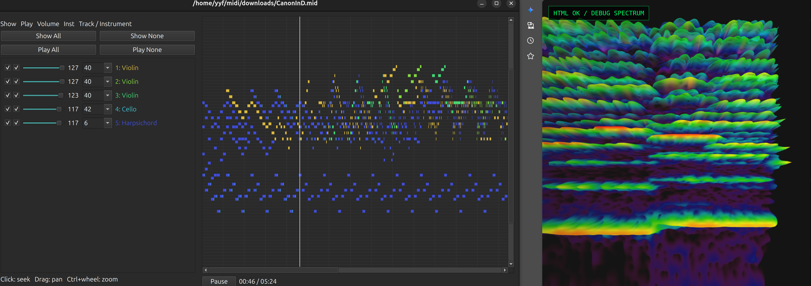
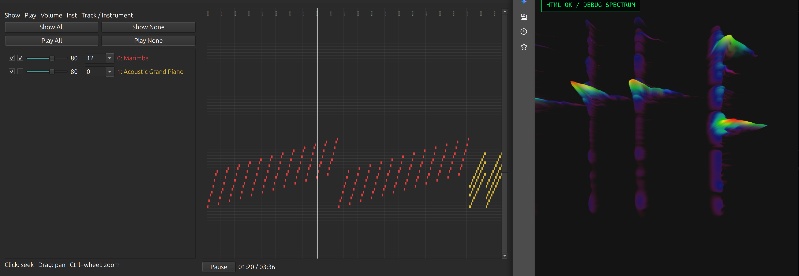
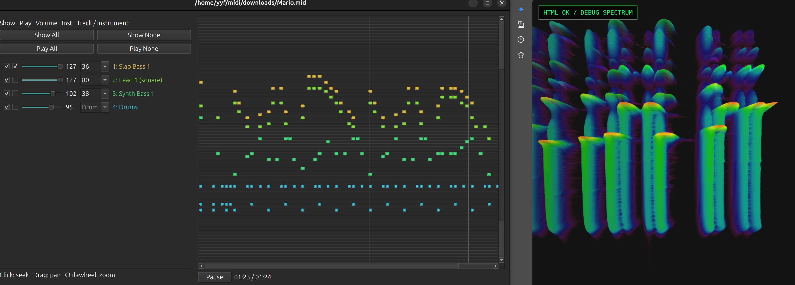
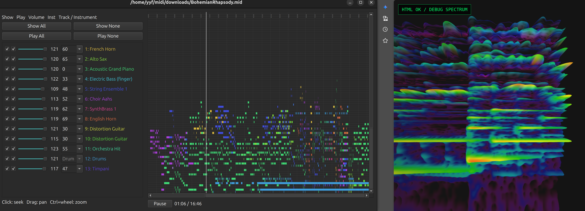
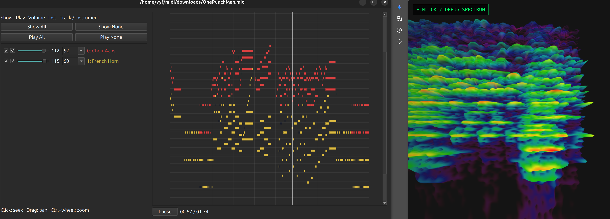
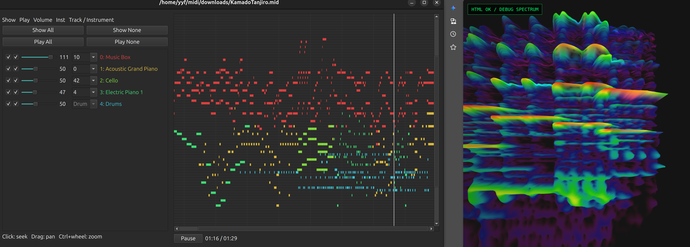
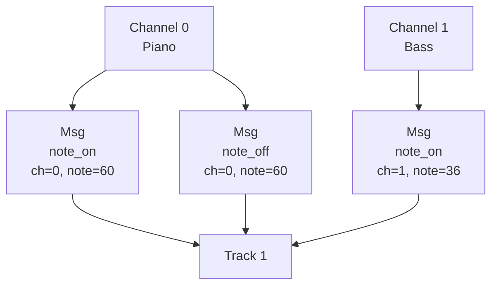
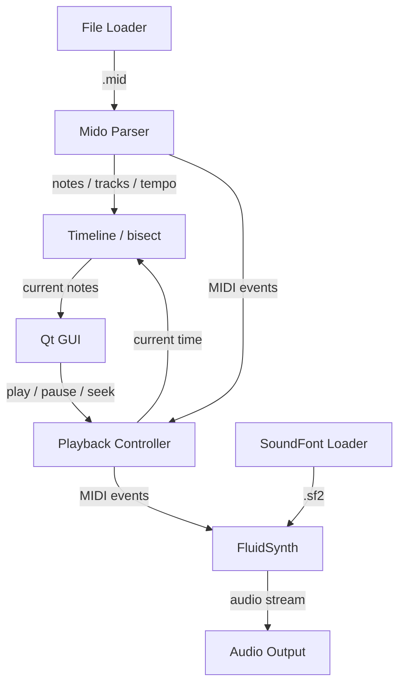

# MIDI Viewer / Player



#### examples
<table>
  <tr>
    <td width="50%">
      
    </td>
    <td width="50%">
      
    </td>
  </tr>

  <tr>
    <td width="50%">
      
    </td>
    <td width="50%">
      
    </td>
  </tr>

  <tr>
    <td width="50%">
      
    </td>
    <td width="50%">
      
    </td>
  </tr>
</table>

#### mido message
https://mido.readthedocs.io/en/latest/message_types.html

#### spectrogram
https://github.com/edyou25/chrome-music-lab.git





#### soundfont
```bash
sudo apt install fluidsynth fluid-soundfont-gm
```
```bash
sudo wget -O /usr/share/sounds/sf2/GeneralUser-GS.sf2 \
https://raw.githubusercontent.com/mrbumpy409/GeneralUser-GS/main/GeneralUser-GS.sf2
```

#### workflow


#### files

```bash
midi
├── config
│   ├── config.yaml
│   └── default.yaml
├── downloads
│   ├── BohemianRhapsody.mid
│   ├── CallofSilence.mid
│   ├── CanonInD.mid
│   ├── KamadoTanjiro.mid
│   ├── Mario.mid
│   └── Oasis.mid
│   └── OnePunchMan.mid
├── environment.yml
├── generate.py
├── outputs
├── play.py
├── plot.py
├── README.md
└── src
    ├── config.py
    ├── __init__.py
    ├── midi.py
    ├── player.py
    ├── plotter.py
    └── track_panel.py
```

#### midi


Shell:
```bash
curl -L "https://bitmidi.com/uploads/87216.mid" \
  -o downloads/BohemianRhapsody.mid
```
```bash
curl -fL "https://www.mfiles.co.uk/downloads/pachelbel-canon-in-d.mid" \
  -o downloads/CanonInD.mid
```
```bash
curl -fL "https://bitmidi.com/uploads/40597.mid" \
  -o downloads/Oasis.mid
```
```bash
curl -fL "https://www.vgmusic.com/new-files/smb-overworld.mid" \
  -o downloads/Mario.mid
```

Web Console:
- https://onlinesequencer.net/2113053
- https://onlinesequencer.net/1668689
- https://onlinesequencer.net/206014
```Javascript
exportMidi()
```

#### FluidR3_GM.sf2

| Program | Instrument              | Program | Instrument           |
| ------: | ----------------------- | ------: | -------------------- |
|       0 | Acoustic Grand Piano    |      64 | Soprano Sax          |
|       1 | Bright Acoustic Piano   |      65 | Alto Sax             |
|       2 | Electric Grand Piano    |      66 | Tenor Sax            |
|       3 | Honky-tonk Piano        |      67 | Baritone Sax         |
|       4 | Electric Piano 1        |      68 | Oboe                 |
|       5 | Electric Piano 2        |      69 | English Horn         |
|       6 | Harpsichord             |      70 | Bassoon              |
|       7 | Clavinet                |      71 | Clarinet             |
|       8 | Celesta                 |      72 | Piccolo              |
|       9 | Glockenspiel            |      73 | Flute                |
|      10 | Music Box               |      74 | Recorder             |
|      11 | Vibraphone              |      75 | Pan Flute            |
|      12 | Marimba                 |      76 | Blown Bottle         |
|      13 | Xylophone               |      77 | Shakuhachi           |
|      14 | Tubular Bells           |      78 | Whistle              |
|      15 | Dulcimer                |      79 | Ocarina              |
|      16 | Drawbar Organ           |      80 | Lead 1 (square)      |
|      17 | Percussive Organ        |      81 | Lead 2 (sawtooth)    |
|      18 | Rock Organ              |      82 | Lead 3 (calliope)    |
|      19 | Church Organ            |      83 | Lead 4 (chiff)       |
|      20 | Reed Organ              |      84 | Lead 5 (charang)     |
|      21 | Accordion               |      85 | Lead 6 (voice)       |
|      22 | Harmonica               |      86 | Lead 7 (fifths)      |
|      23 | Tango Accordion         |      87 | Lead 8 (bass + lead) |
|      24 | Acoustic Guitar (nylon) |      88 | Pad 1 (new age)      |
|      25 | Acoustic Guitar (steel) |      89 | Pad 2 (warm)         |
|      26 | Electric Guitar (jazz)  |      90 | Pad 3 (polysynth)    |
|      27 | Electric Guitar (clean) |      91 | Pad 4 (choir)        |
|      28 | Electric Guitar (muted) |      92 | Pad 5 (bowed)        |
|      29 | Overdriven Guitar       |      93 | Pad 6 (metallic)     |
|      30 | Distortion Guitar       |      94 | Pad 7 (halo)         |
|      31 | Guitar Harmonics        |      95 | Pad 8 (sweep)        |
|      32 | Acoustic Bass           |      96 | FX 1 (rain)          |
|      33 | Electric Bass (finger)  |      97 | FX 2 (soundtrack)    |
|      34 | Electric Bass (pick)    |      98 | FX 3 (crystal)       |
|      35 | Fretless Bass           |      99 | FX 4 (atmosphere)    |
|      36 | Slap Bass 1             |     100 | FX 5 (brightness)    |
|      37 | Slap Bass 2             |     101 | FX 6 (goblins)       |
|      38 | Synth Bass 1            |     102 | FX 7 (echoes)        |
|      39 | Synth Bass 2            |     103 | FX 8 (sci-fi)        |
|      40 | Violin                  |     104 | Sitar                |
|      41 | Viola                   |     105 | Banjo                |
|      42 | Cello                   |     106 | Shamisen             |
|      43 | Contrabass              |     107 | Koto                 |
|      44 | Tremolo Strings         |     108 | Kalimba              |
|      45 | Pizzicato Strings       |     109 | Bag Pipe             |
|      46 | Orchestral Harp         |     110 | Fiddle               |
|      47 | Timpani                 |     111 | Shanai               |
|      48 | String Ensemble 1       |     112 | Tinkle Bell          |
|      49 | String Ensemble 2       |     113 | Agogo                |
|      50 | SynthStrings 1          |     114 | Steel Drums          |
|      51 | SynthStrings 2          |     115 | Woodblock            |
|      52 | Choir Aahs              |     116 | Taiko Drum           |
|      53 | Voice Oohs              |     117 | Melodic Tom          |
|      54 | Synth Voice             |     118 | Synth Drum           |
|      55 | Orchestra Hit           |     119 | Reverse Cymbal       |
|      56 | Trumpet                 |     120 | Guitar Fret Noise    |
|      57 | Trombone                |     121 | Breath Noise         |
|      58 | Tuba                    |     122 | Seashore             |
|      59 | Muted Trumpet           |     123 | Bird Tweet           |
|      60 | French Horn             |     124 | Telephone Ring       |
|      61 | Brass Section           |     125 | Helicopter           |
|      62 | SynthBrass 1            |     126 | Applause             |
|      63 | SynthBrass 2            |     127 | Gunshot              |
